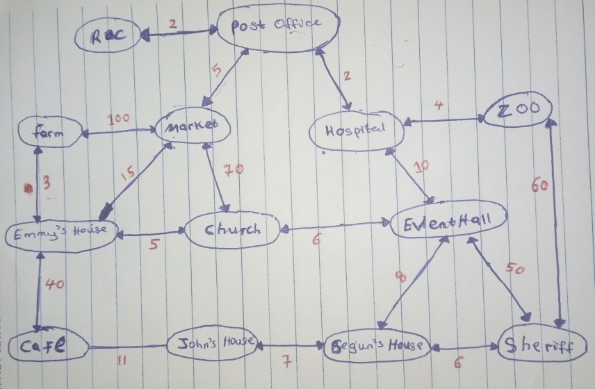

# DELIVERY ROBOT 
In the small Village of __Know Where__. The village is made of __13 houses (nodes) and 18 roads (edges) with distances (weights) which total to 402 kilometeers.__

Each node is a House, or a company, or viewing center or shop. The edges are the roads that leads to those edges and the weights represents the distance of the roads in Kilometers.

The village is small with but the people in there are so lazy, that each person delivering his/her parcels to their neighbours seems pretty much like a big job even taking their mails to the Post office for delivery is no do. The citizens like to be alone doing what they like best, all best known to them. 

The bellow Graph Image shows the whole map of the village.  

---
## THE ROBOTIC COMPANY AND THE ROBOTS
 Even most Post Office officers ( Postmen ) seems lazy except me though 😂🤣 the manager of the __Robot Brain Program ( RBP )__ a subsidiary of __Robotic Company ( RC )__ the other is __Robot Brawn Building ( RBB )__ (they build the Robot Body). Which are all located beside the __Post Office__.
 
Our job in this company is to build robots that go each house, shop etc, carry every parcel, goods, presents and deliver them at their respective addresses. 

This takes the burden of the citizen taking their mails, parcels even presents and gifts to the __Post Office__ and the postmen delivering them.

Since the launch of the first __Robot__. Both the postmen and the villagers have become more lazy. 
 
Because all what the Villagers do is lodge in into the __Robot App.__  ( Which was built by the __RBB__ department ).  
register their parcels provide the location and the delivery address of the parcel.  
Then the Robot after reading the registered parcels in __Robotic App__. 

Firstly the __Robot__ decides to go out to the locations of every parcel and carry it. It might deliver some on the way but its aim is to first carry and gather all the parcels before trying to deliver them to their respective addresses. normally, it cannot deliver what it hadn't carried.
Secondly the __Robot__ decides to go deliver all parcels at their respective addresses.

 We've programmed four __Robot's Brain__ so far.

    1. Random Route Robot ( R.R.R )
    2. Fixed Route Robot ( F.R.R )
    3. Route Generator Robot ( G.R.R )
    4. Shortest Route Robot ( S.R.R )
 

### Random Route Robot ( R.R.R )
This makes it really inefficient
1. This Robot was programmed based on the assumption that at one point in time the robot after wandering the whole village multiple times would get to location and address of the parcel.
 
2. It implements the __Math.random() function__. This make it move to a random (or any ) location making it very unpredictable.

3. Although, it had the data about the locations of the parcels and even the total number of parcel to be delivered, it did not have the memory about perfect route to get to its destination. 

4. It did not have the memory of its last visit for example it might move from __Market__ to __Farm__ and back several times (which is pretty, pretty far) before deciding to go somewhere else. Which would usually lead to great a number of ___turns__ and __distance__ moved. 
Whereas other villagers would be waiting for parcels to picked or/and delivered. 

5. The above disadvantages usually lead to villagers not receiving their mails and parcels on time. This gave us thousands of negative feedbacks

### Fixed Route Robot ( F.R.R )
This __Robot's Brain__ was developed to solve the negative feedback we were recieving from the villagers.  
Normally, before the advent of any these robots. The postmen had a fixed route around the Village. This make their movement to be predicted ( The villagers knew where they will be at given time of the day).

All we did was make the __Robot__ simulate this behaviour. The __Robot__ would move around the Village two times. With the knowledge that it would carry, and gather the parcels in its first movement around the village and would deliver them the second time. These reduced the turns of the __Robot__ to a maximun of 26 turns and 2 x 402 = 804 Kilometer distance.

Moreso, the __Robot Brain__ make the __Robot__ remember its previous visit and know its next visit due to the __memory__ installed but it could not get its own Route around the Village beacuase it had been hard coded in its memory.

Although, the feedbacks from the villagers were positive at least they got the simulation of the postmen service, which make us happy for a while. But this would be cut short as new buildings (a lot of them --new Nodes--) were been built in the Villages . The Village got advanced, more infrastructure. The map (Graph) of the Village got more advanced in terms of size.

These give even more problems than __R.R.R__ in that:
1. Because the Route of the robot was hard coded, we needed to update the Route on each building been built.  
2. New Villagers won't get to benefit from the __Robot__ service if we the __RBP__ wouldn't upadate the Robot's Route.
3. The turns and distance of the Village had increased drastically therefore. We needed to rack our head further to get the perfect Route around the Village by doing a lot of surveys. Which were not guarranted to be accurate
4. At least the __R.R.R__ ran around the Village randomly but still got the Job done with little or no update the __F.R.R__ was not so (we needed to to update the Route for every bulding been built).  
Still though the __F.R.R__ would move at a much lesser turns and distance than __R.R.R__ to get the Job under the same conditions.

This problem got us to the program room for new ideas.

### Route Generator Robot (G.R.R)
After so much deep learning (I'm kidding right 😂🤣) we built a __Robot Brain__ that could learn by it self (please flow with the vibe 😂). 
This __Brain__ would later be one of the two most efficient __Robot Brain__. It learns by using the data of the Village map (graph).
This __Robot Brain__ was pretty advanced in that:
1. It learns from the data of the Vilage given to it and add to the data on each visit to a building (or node ). 
2. It has memory of its last visit and know where its going and can generate the shortest route from its location to its destination. By implementing __BFS__ or __Level Order Search Algprithm__
3. It does this by considering  each next house (node) as the closest entity without giving regards to their distances. (Which is a disavantage though, but an advantage over the earlier __Robot Brain__). This makes the __Robot__ to make lesser turns than the previous __Robot Brain__.
4. The __Robot__ using this __Brain__ generates its own __Route__ to its destination without given much thought to the distance to be covered. At least it learns and decides and does the job without having a fixed or random route memory.

This was a mind blowing program which was almost perfect and was loved by the Villagers but it had a short coming. let's face it. A Robot that gives no regards to numbers (distances) is no efficient robot at all. 
This would lead us to program another __Robot Brain__ to resolve this issue.

### Shortest Route Robot (S.R.R)
__S.R.R__ does what __G.R.R__ does but better. It is currently the __Robot__ used by the __Know where__ Villagers.
It generates __shortest route__ to its destinaton from its location by considering each next house (node) and the distance between its location and these next houses (nodes). 

This was so because the __Robot__ implements __BFS__ and __Dikjistra Algorithms__. Making it the most efficient __Robot__ for 
now.

For example: Given a parcel at location of __Market__ and delivery address to be __Farm__ which is __100 kilometer__ far from each other.
__G.R.R__ will move thus:  
    __Post Office__ ==> __Market__ (carry the parcel) then head straigt to __Farm__ to deliver it. thus traveling a total distance of __105 Km__ and with __2 turnings__.

__S.R.R__ on the other hand will move thus:  
    __Post Office__  ==> __Market__ (carry the parcel) ==> __Emmy's House__ then to __Farm__ to deliver it. thus traveling a total distance of __23 km__ with __3 turnings__. 

The __Know Where__ Villagers are praising us because we've solved their problem. And I'm Happy.